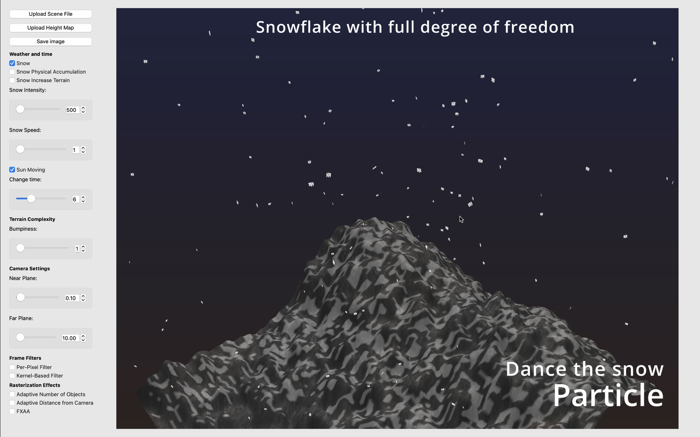
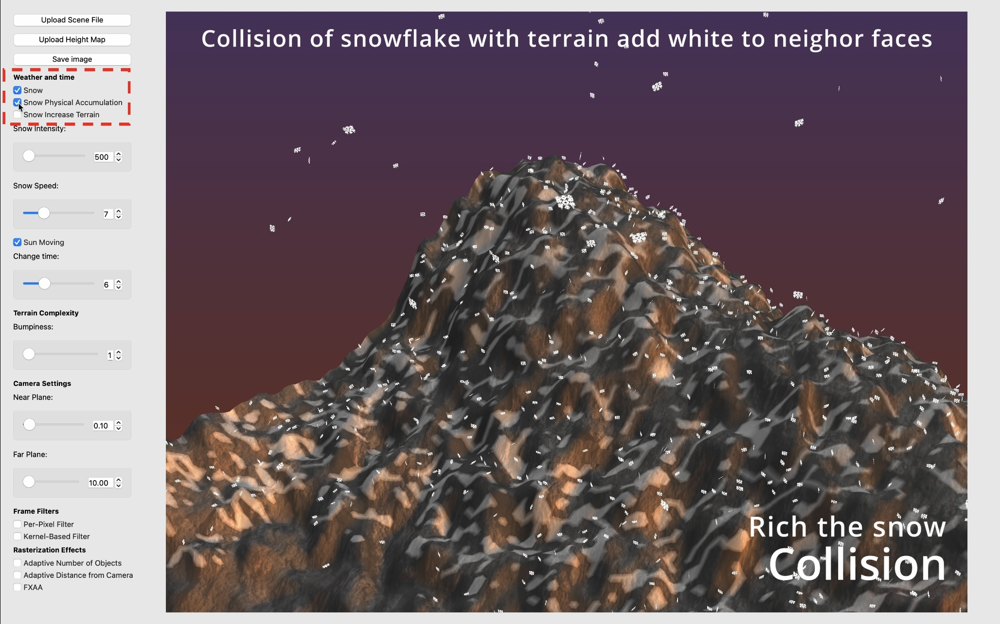

# Realtime Snowy Mountain System 


**Brown University CSCI 1230/2230 Computer Graphics Final Project.**

**Group Name: Cyber Mountaineering Expedition**

**Keywords:** procedural terrain generation, particle system, physical collision system, solar system

## Get started

- CMake with ```CMakeLists.txt```, build, and run the source code.
- Load the ```standard_view.json``` scenefile. After loading the scenefile, there is a default terrain showing on the screen.
  
- If one wnats to load different height maps as terrain, click **Upload Height Map** button and select a height map image.
  

## Key features Explained

### Terrain generation

- **Generation from height maps**:
  
- **Adjust bumpiness**:
  

### Particle system
The particle system uses a two-sided square primitive for simple snowflake rotation and minimal triangle calculations. Snowflake velocity is constant in the y-direction, balancing gravity and air resistance, with random radial acceleration for wind simulation. Snowflakes reinitialize upon reaching the terrain or falling below `y=-0.1`.


- **Adjust the speed**:
  
- **Adjust the intensity**:
  

### Collision detection

The snow accumulation system calculates the real snow-terrain collision and change the visual appearance of terrain to emulate the accumulation of snow. There are three modes:

- **Default mode**: The collision point on the terrain will gradually become white.
  
- **Snow Physical Accumulation** clicked: Snowflake will stop and physically accumulate on the terrain to emulate the fine-grained snow accumulation. Note that depend on different computer hardware capabilities, too much accumulation may affect frame rates.
  
- **Snow Increase Terrain** clicked: The collision point on the terrain will gradually increase to emulate real snow accumulation. Note that such increase would be more observable by zooming in or waiting for more snow accumulation.
  

### Solar system

The solar system emulates the 24-hour sun movement.


- **Change Time** toggled: By toggling, one can change the current time. The sun will automatically move on from the toggled time.
  
- **Sun Moving** clicked: Stop or let the sun move. 
  

Enjoy the beauty of Computer Graphics!

